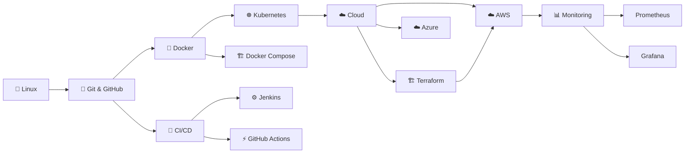
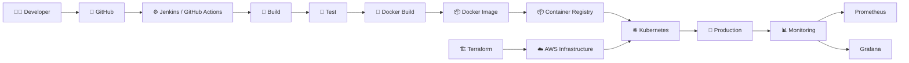
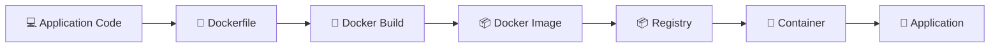
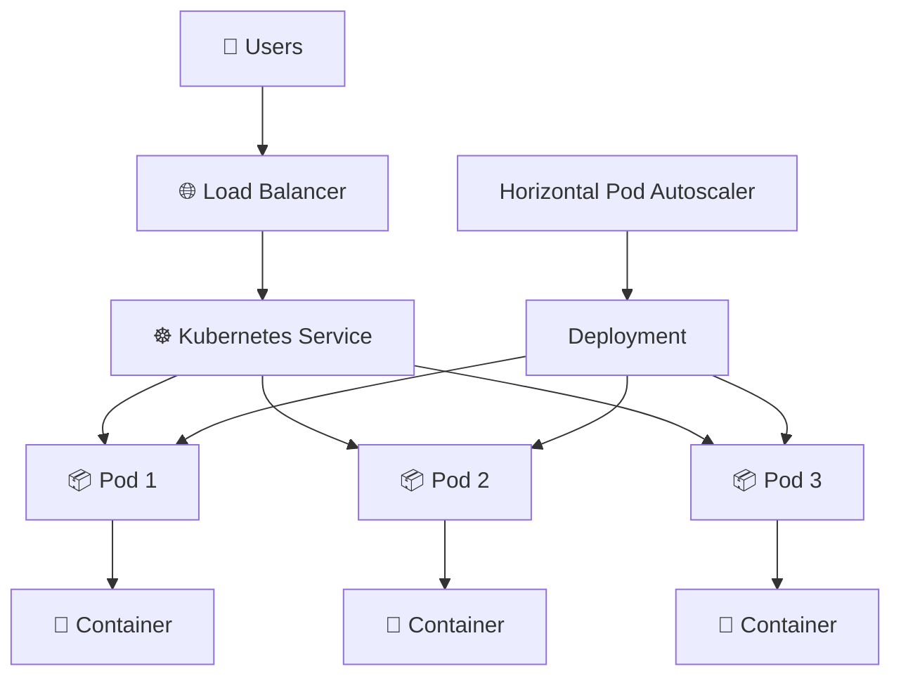
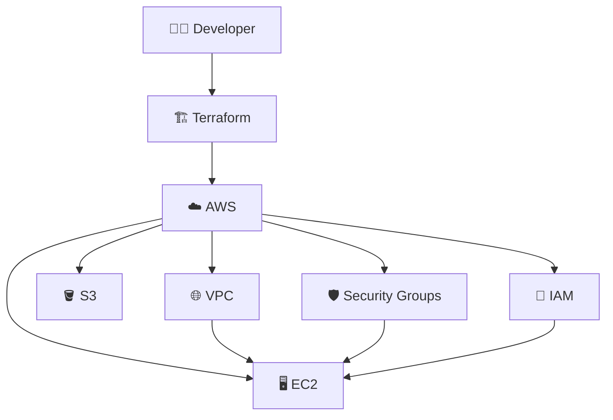
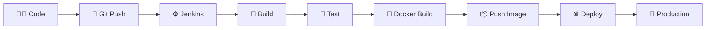
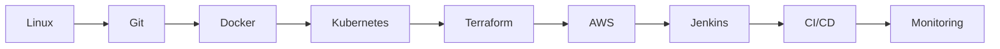
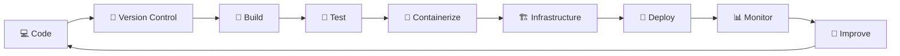

# 🚀 DevOps Playground

  <b>My hands-on journey into DevOps, Cloud, Containers, CI/CD & Infrastructure Automation.</b>

---

## 🧭 DevOps Learning Roadmap

---

## 🔄 Real-World DevOps Workflow

---

## 🐳 Containerization Workflow

---

## ☸️ Kubernetes Architecture

---

## 🏗️ Infrastructure as Code

---

## 🔄 CI/CD Pipeline

---

## 🛠️ Technologies I'm Learning

### 🐧 Fundamentals

* Linux
* Shell Scripting
* Git
* GitHub

### 🐳 Containers

* Docker
* Docker Compose
* Container Registry

### ☸️ Orchestration

* Kubernetes
* Pods
* Deployments
* Services
* ConfigMaps
* Secrets
* Ingress
* HPA

### 🏗️ Infrastructure as Code

* Terraform
* AWS Infrastructure
* Terraform Modules
* Remote State

### 🔄 CI/CD

* Jenkins
* GitHub Actions
* Automated Testing
* Automated Docker Builds
* Automated Deployment

### ☁️ Cloud

* AWS
* Azure
* EC2
* VPC
* IAM
* S3
* Security Groups

### 📊 Monitoring

* Prometheus
* Grafana
* Application Monitoring
* Infrastructure Monitoring

---

## 📈 Learning Progress

---

## 🎯 My DevOps Goal

Become capable of taking an application from **source code to production** using modern DevOps practices.

---

## 💡 Learning Philosophy

> **Learn → Practice → Automate → Deploy → Monitor → Improve**

This repository is my **hands-on DevOps playground**, where I experiment with tools, build real-world workflows, practice automation, and document what I learn.

---

## ⭐ Follow the Journey

If you find this repository useful, feel free to ⭐ the repo and follow along with the journey.

**Keep learning. Keep building. Keep automating. 🚀**
